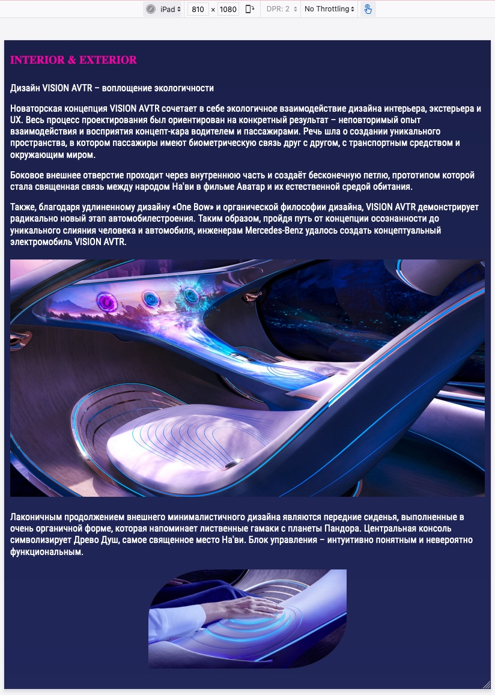

# AVTR Website

AVTR is a project created from mockup. Using Figma for detailed study and use of the layout. The following technologies were used in the project: HTML, CSS, CSS reset file, JavaScript, Google Fonts and including external fonts, jQuery, slick library for create slider on the site.

## Below are screenshots of the finished site and animated gif.

### Site view at 1080 full HD

### Site view on Galaxy Note9

### Site view on iPad

### Site view on iPhone 12 Pro

