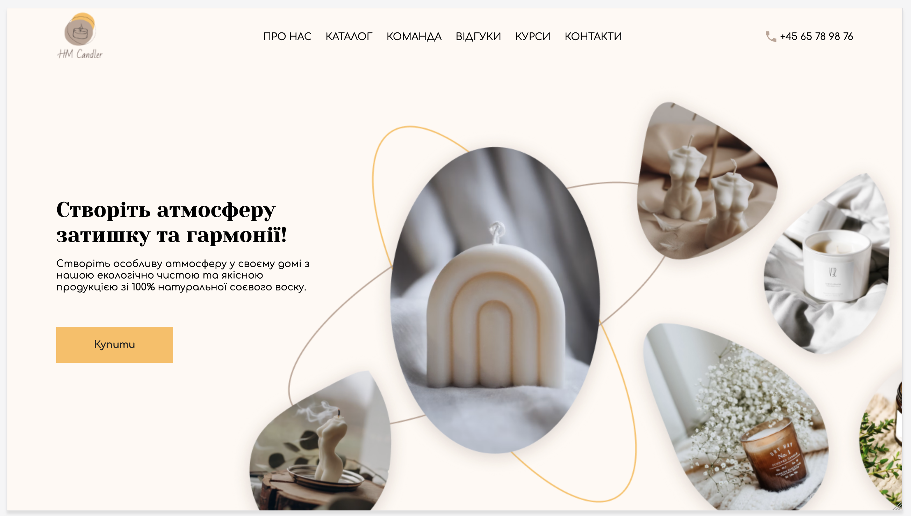
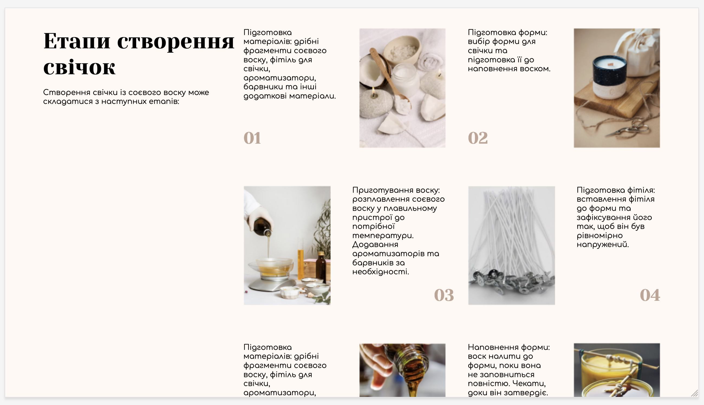
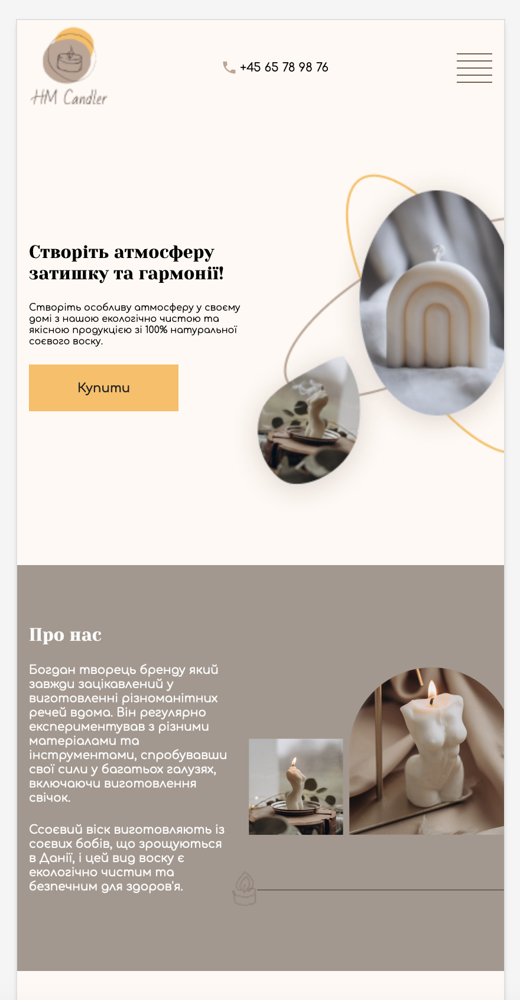
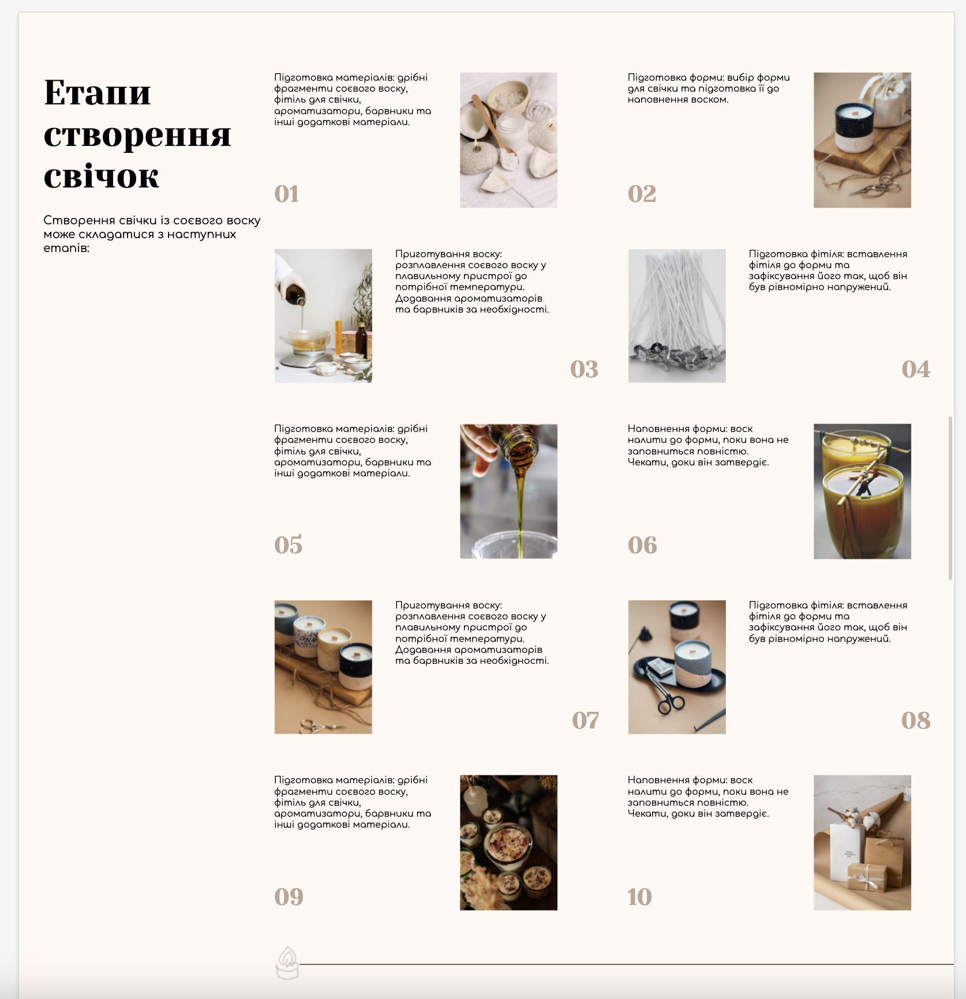
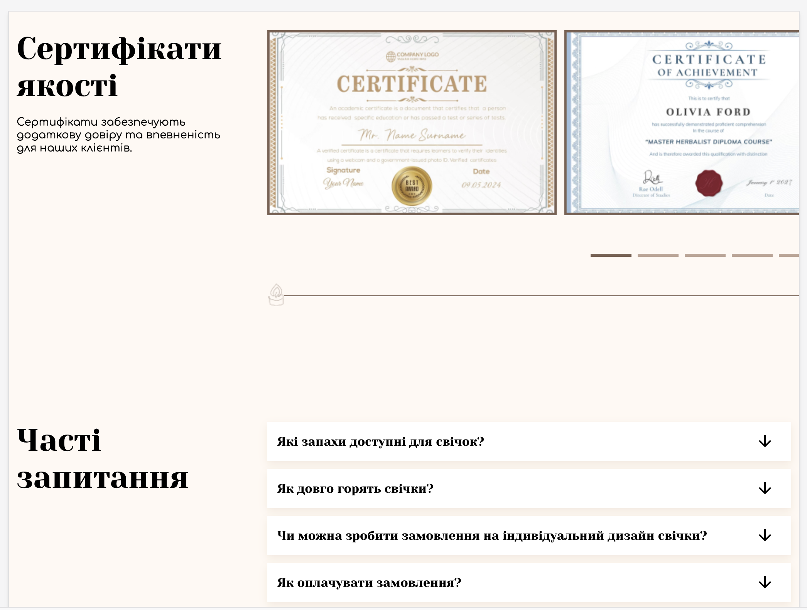
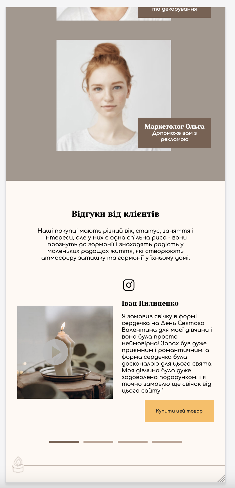
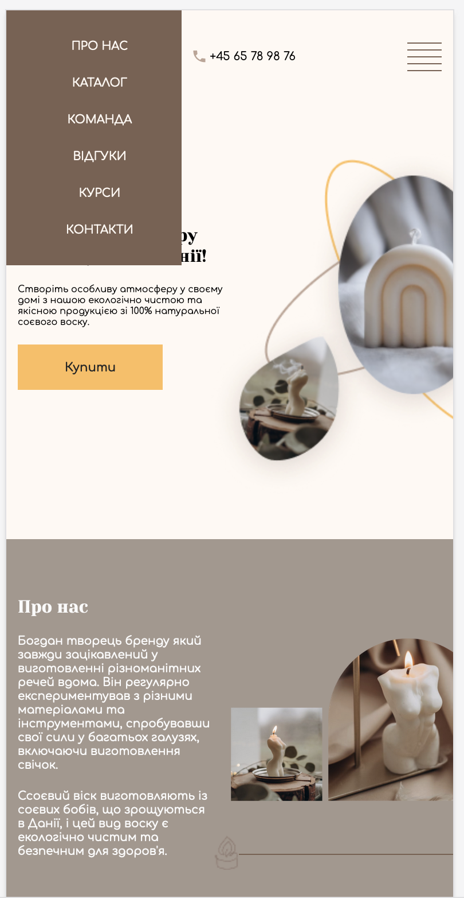

# HM_CANDLER Website

HM_CANDLER is a project created from mockup. Using Figma for detailed study and use of the layout. The following technologies were used in the project: HTML, CSS, CSS reset file, JavaScript, Google Fonts and swiper library for create slider on the site.

This work is based on the video of the master class from **[Site layout, html/css/js detailed explanation](https://youtu.be/onZV8QqH76g?si=9AtP7VaFAy7fubiG)** by *[vadymprokopchuk](https://www.youtube.com/@vadymprokopchuk)*

## Below are screenshots of the finished site and animated gif.

### Site view on Television 720pHD

### Site view on Galaxy Note20

### Site view on iPad

### Site view on iPadPro

### Site view on iPhone 12 Pro

