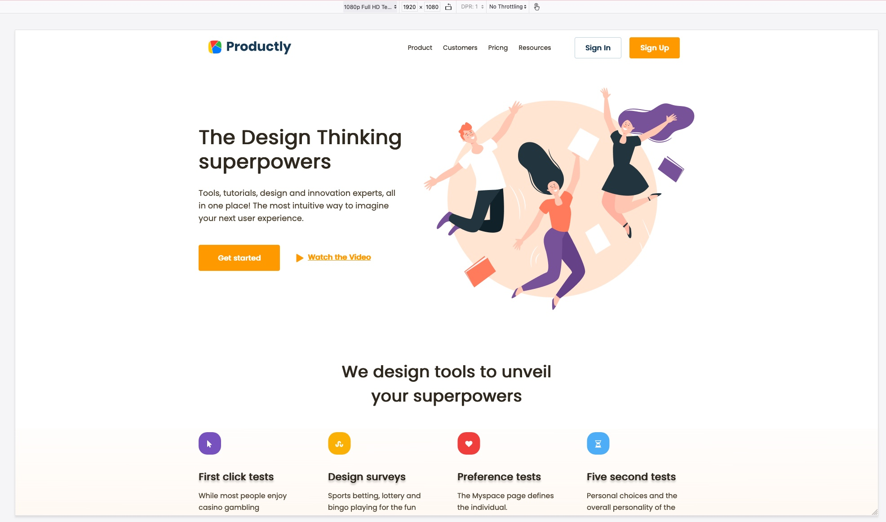
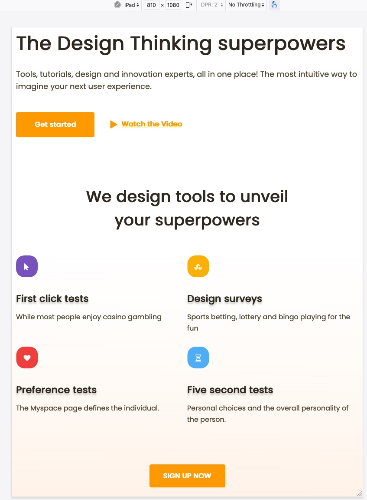
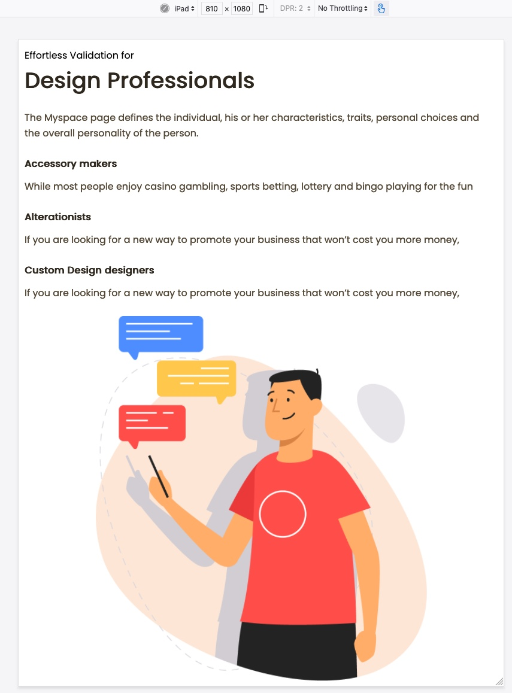
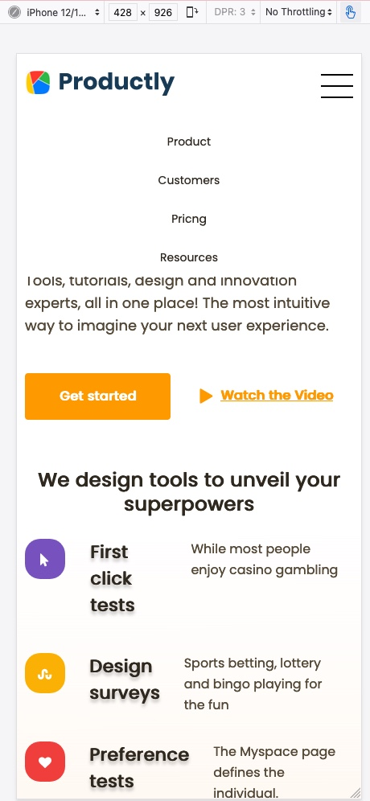

# Productly

Productly is a project created from mockup. Using Figma for detailed study and use of the layout. The following technologies were used in the project: HTML, CSS, JavaScript, Google Fonts, jQuery, slick library for create sliders on the site.

## Below are screenshots of the finished site and animated gif.

### Site view at 1080 full HD

### Site view on Galaxy Note 9

### Site view on iPad

### Site view on iPhone12 Pro

