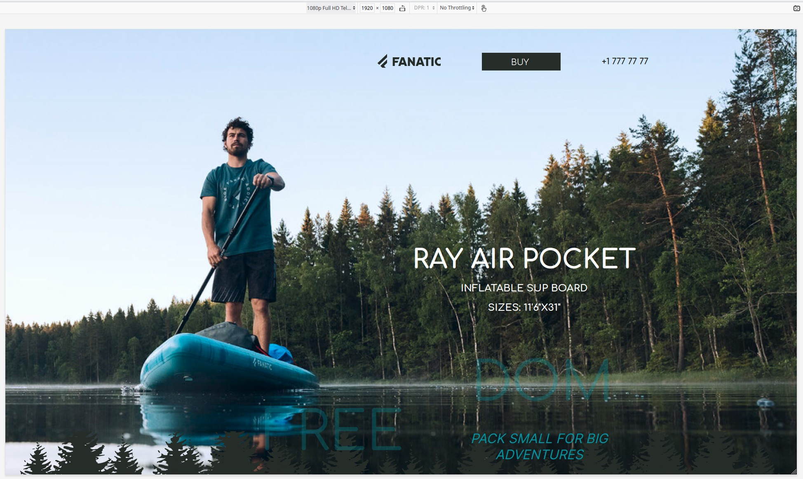
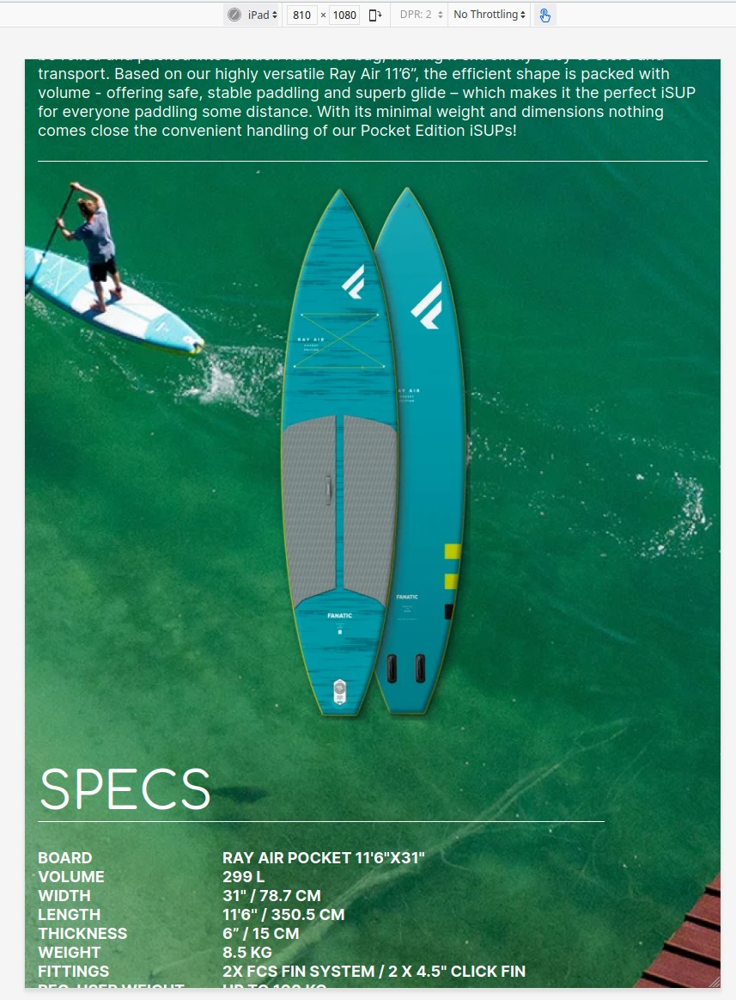
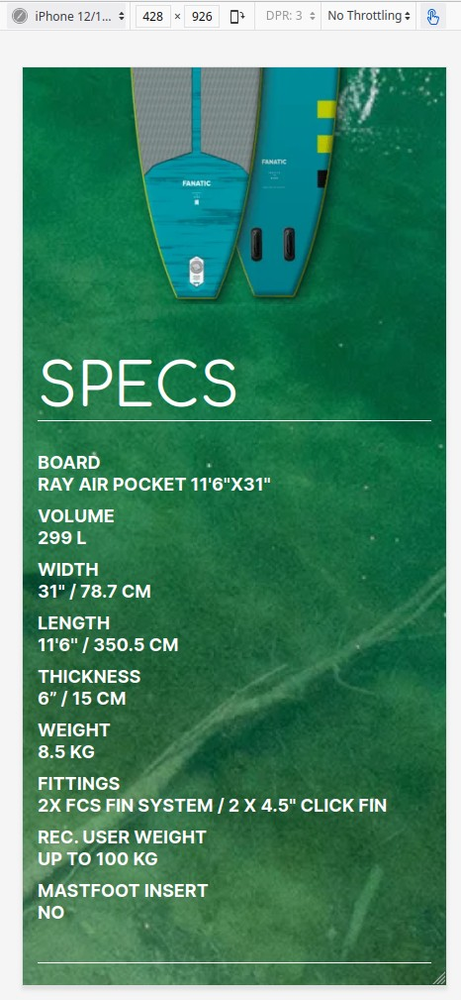

# SubBoard-Fanatic

SubBoard-Fanatic is a project created from mockup. Using Figma for detailed study and use of the layout. The following technologies were used in the project: HTML, CSS, Google Fonts.

## Below are screenshots of the finished site and animated gif.

### Site view at 1080 full HD

### Site view on iPad

### Site view on iPhone12 Pro

